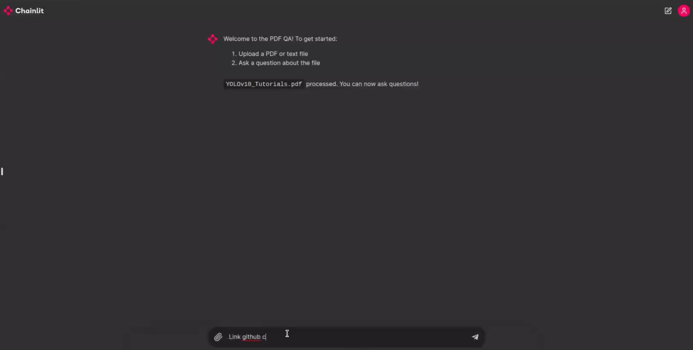

# TextRAG-bot-project
## Introduction

Ever wished you had a superhero sidekick who could help you read and understand documents in a flash? Well, say hello to **TextRAGBot** - a tool that uses RAG to read and interact with PDF documents through a user-friendly chatbot interface built with Chainlit.

🚀 This project is designed to run on both Google Colab and local, making it easy for anyone to get started!

**Note:** This project is one of my submission for the first module of an AI Course.


## Prepare
1. **Clone the repository:**
   ```sh
    git clone https://github.com/hannguyen2880/TextRAG-bot-project.git
    cd TextRAG-bot-project
    ```
2. **About Google Colab:**
- [Click here to open the Colab notebook](https://colab.research.google.com/) and log into your account.
- Change the run time of your notebook from CPU to GPU.

3. **Intall the required dependencies:**

    You can see all essential packages in **'requirements.txt"** file. To install them:
- **In Google Colab:** Follow the instruction the file notebook (.ipynb). Make sure you changed the run time of your notebook from CPU to GPU.
- **In local:**
    ```sh
    pip install -r requirements.txt
    ```
## Usage
Running TextRAGBot is easier than making a cup of coffee. ☕
1. **On Google Colab:**

    I prepared 2 files .ipnynb [RAQ_project_without_UI.ipynb](https://colab.research.google.com/drive/1CVKy9o_u4bJlp6j31cNGN4qT5a5mIeYl?usp=sharing) and [RAG_project_with_UI.ipynb](https://colab.research.google.com/drive/1HAgdUH3PhfImerSGkQ_vjxa2mggKSUfr?usp=sharing). You can try running all of them by step-by-step instruction to see the result.

2. **Run locally:**
- Start the application:
    ```sh
    chainlit run chainlit_app.py
    ```
- Open your web browser and go to **http://localhost:8000**.
- Upload a PDF or text file and start asking questions. Sit back and enjoy as TextRAGBot works its magic! ✨
  
  **Note:** Make sure that your device has GPU enough to run this project locally.

## Conclusion
**Thanks very much** for checking out my textRAGbot project! I hope that you had a great experience. If you have any questions or feedback, feel free to reach out.
